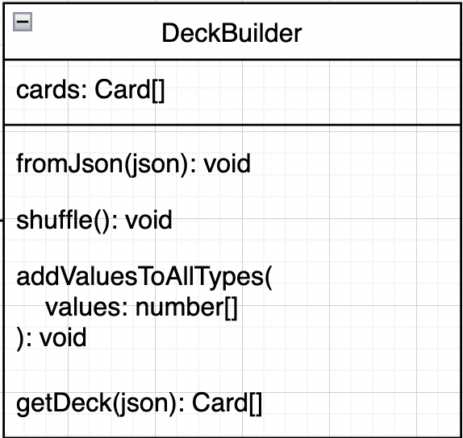
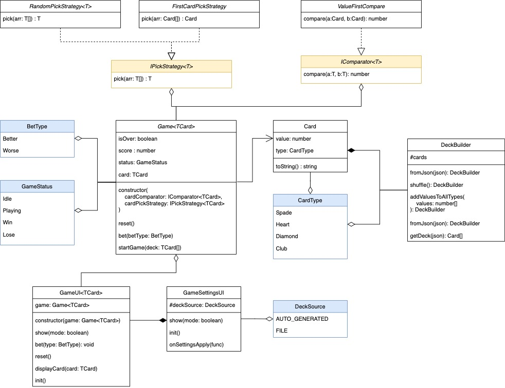

# Card Game

## התחלת עבודה באזרחי (DEV PURPOSES ONLY)

 השתמשו בdegit על  מנת להוריד את הבוילרפלייט:
 
```bash
npx degit https://github.com/MatanelGordon/BMS-card-game#boilerplate
```

 או אם אתם רוצים לפתוח את הפרוייקט בתיקייה מסויימת:

```bash
npx degit https://github.com/MatanelGordon/BMS-card-game#boilerplate my-folder
```

## התחלת עבודה

ראשית, פתחו פרוייקט גיט באמצעות bitbucket, gitlab או TFS ותעשו clone אליכם למחשב.
לאחר מכן, פתחו טרמינל על התיקייה.

על מנת להתחיל פרוייקט בסיסי:

```bash
npx degit <URL_REPO_HERE>
```

ועכשיו, נתחיל את המשחק עם גיט:

1. תעשו קומיט לקובץ ה-gitignore בלבד

```shell
    git add .gitignore
    git commit -m "initial commit"
```

2. תעשו קומיט לשאר הקבצים

```shell
git add .
git commit -m "basic boilerplate"
```

3. תעשו push להכל

```shell
git push origin master
```

4. תעברו מ-master ל-branch אחר

> לרוב לא מפתחים קוד על המאסטר- לשם מגיע רק קוד שעבר בדיקה של גורם נוסף

```shell
git checkout -b dev
```


## הרמת פרויקט

התקינו את החבילות של הפרוייקט באופן הבא:

```shell
npm i
```

על מנת להרים שרת שיראה את השינויים הנוכחיים שלכם ויתעדכן עבור כל שינוי של קובץ, הריצו את הפקודה הבאה

```shell
npm run dev
```

היכנסו לכתובת שהוא מדפיס לכם, לרוב יהיה [`http://localhost:3000`](http://localhost:3000)

****

## קצת על הפרוייקט

כרגע יש לכם פרוייקט טייפסקריפט שאת הקוד הסופי הוא מריץ על הדפדפן. אם תריצו את הפרוייקט תוכלו לראות UI שנבנה במיוחד בשבילכם יחד עם ספרייה שעוזרת לשלוט על ה-UI בצורה הכי פשוטה שאפשר.

## דוקומנטציה של `ui@`

על מנת להשתמש ב-ui@ יש לייבא אותו בצורה הבאה:

```javascript
import gameUI from "@ui";
```

דרך gameUI מספר פונקציות מונגשות:

1. onGameStart

קוד שירוץ כל פעם שהמשחק מתחיל (עובד על מצב מתקדם בלבד)

2. onHigheBetClick

קוד שירוץ כל פעם שלוחצים על כפתור Higher

3. onLowerBetClick

קוד שירוץ כל פעם שלוחצים על כפתור Lower

4. onBetClick

קוד שירוץ כל פעם שלוחצים על אחד הכפתורים Higher/Lower

5. onResetClick

קוד שירוץ של פעם שלוחצים על כפתור Reset

6. setScore

מציג את הניקוד

7. setCurrentCard

מציג את הקלף הנוכחי

8. winGame

משבית את המשחק ומציג שהמשתמש ניצח

9. loseGame

משבית את המשחק ומציג שהמשתמש הפסיד

10. reset

מנקה את התצוגה ומאפס אותה למצב התחלתי

11. setHigherButtonColor

מאפשר לקבוע את צבע הרקעת הטקסט וה-border של כפתור Higher

12. setLowerButtonColor

מאפשר לקבוע את צבע הרקעת הטקסט וה-border של כפתור Lower

13. setButtonsShape

מאפשר לקבוע את הצורה של כפתורי המשחק - Higher\Lower

14. advancedMode

כניסה למצב מתקדם - במצב זה לפני כל תחילת משחק יופיע חלונית הגדרות שמאפשרת לקבוע מאיפה החפיסה ומה האסטרטגיה של לקיחת הקלף.

המשחק מתחיל רק כאשר המשתמש מסיים את האינטרקציה שלו עם חלונית ההגדרות.

אפשרויות למקור החפיסה: 

- מיוצרת רנדומלית לבד
- מתוך קונפיגורציה

אפרויות לאסטרטגיית לקיחת קלף:

- הראשון בחפיסה
- רנדומלי מהחפיסה

`הערה: יש להשתמש בפונקציה ()advancedMode פעם אחת בקוד ואך ורק בקובץ main.ts מתחת ל-imports`

## מבנה הפרוייקט ודגשים

קובץ הטייפסקריפט הראשי הוא `main.ts`. בפרוייקט אתם תראו תיקיית UI שהוא הקוד שאחראי על לפשט את ההתעסקות עם ה-UI. אין לגעת בתיקייה או בקבצים בתוכה ללא אישור של המפקדים.

כמה הערות על המשך העבודה: 

1. תוודאו שאתם מחלקים לקבצים - אין לעשות קובץ אחד ענק עם 500 שורות.

2. תוודאו שאתם מחלקים נכון לתיקיות

3. תוודאו שאתם עושים export עבור פונקציות, משתנים, מחלקות או טייפים שאתם רוצים שהקובץ ייחצן

4. אין להתעסק עם ספריית UI או קובץ הHTML ללא אישור מהמפקדים

5. אתם מקבלים את הפרוייקט עם תרגיל מקדים - יש לעשות את התרגיל המקדים לפני שמתחילים את הפרוייקט.

6. שמרו על קוד נקי, ריווח והזחות נכונות, ותנו שמות אינדיקטיביים

7. תהנו.

## תרגיל מקדים

הערה: התרגיל אמור להתבצע בmain.js אין צורך להגזים בתרגיל הזה, שמרו את הכוחות לתרגיל האמיתי

אין צורך לשמור את התרגילים בצד ומומלץ למחוק את התוכן של main.js בין תרגיל לתרגיל

### תרגיל 1

כתבו קוד שכאשר לוחצים על כפתור Lower, המשחק יסתיים בהפסד, וכאשר לוחצים על כפתור Higher המשחק יסתיים בניצחון

הערה: תשתמשו ב-winGame ו-loseGame בתוך gameUI עבור לסיים משחק בניצחון או הפסד

### תרגיל 2

צרו משתנה count, שכאשר לוחצים על כפתור Higher הוא יעלה את הערך ב-1. אם count הגיע ל-3 יש להציג שהמשתמש ניצח.

עבור כל פעם ש-count משתנה, יש לעדכן את הscore בתצוגה. השתמשו ב-setScore על מנת לעדכן את הערך הנוכחי של התוצאות ב-UI.

הערה: תשתמשו ב-winGame ו-loseGame בתוך gameUI עבור לסיים משחק בניצחון או הפסד

### תרגיל 3

```typescript
const names: string[] = ["Shira", "Nitzan", "Noa"]
```

עבור מערך זה של שמות, כתבו קוד שאחרי שלוחצים על שני הכפתורים השם יוחלף לשם הבא ברשימה.

במידה ולחצו על אחד הפתורים ברצף, המשחק ייסתיים בהפסד.

במידה והגעתם לשם האחרון ברשימה, השם הבא הוא השם הראשון ברשימה.

### תרגיל 4

הכניסו את המשחק למצב מתקדם.

כתבו קוד שאם המשתמש מתחיל את המשחק עם הגדרות מסויימות, המשחק יתנהל באופן אחר לגמריי:

אם המשתמש בוחר בחפיסה מהקונפיגורציה וקלף ראשון מהחפיסה: המשחק ימשיך כך שאם לוחצים על כפתור ה-Higher הניקוד יעלה ב-1, אך כאשר לוחצים על כפתור Lower ואז על כפתור Higher המשחק יתאפס

אם המשתמש מתחיל את המשחק עם הגדרות שונות, המשחק יסתיים בהפסד מיד

`הערה: הקוד ב-onGameStart תמיד ירוץ לפני onHigherBetClick, onLowerBetClick או onBetClick`

## התחלת מימוש

### CardType

צרו `enum` בשם `CardType` שיכיל את סוגי הקלפים השונים. עבור כל ערך תנו מספר - ככל שהמספר גבוה יותר כך סוג הקלף חשוב יותר מאחרים.

### Card

צרו מחלקה בשם `Card` שתקבל 2 ערכים:

- `value`: ערך מספרי של הקלף
- `type`: סוג הקלף 

ממשו עבור המחלקה פונקציה `toString` שמציגה את ערך הקלף והסוג שלו בצורה קריאה

### DeckBuilder

צרו מחלקה בשם `DeckBuilder` שתהיה אחראית ליצירת חפיסות קלפים. חפיסת קלפים זה מערך של מחלקת `Card`



- למחלקה אמורה להיות פונקציה שמקבלת רשימה של ערכים מספריים ועבור כל מספר מייצרת 4 קלפים מסוגים שונים אך אותו מספר. הפונקציה שומרת את הקלפים שנוצרו בתוך משתנה של המחלקה `cards`

```typescript
addValuesToAllTypes(values: number[]):void
```

> עבור כל ערך, אם הוא לא בין 1 ל-10 אין להשתמש בו.

- למחלקה אמורה להיות פונקציה שמקבלת אובייקט JSON שהוא מערך של  אובייקטים בו כל אובייקט מייצג קלף, והיא מוסיפה את הקלפים ל-`cards`

```typescript
fromJson({type:string, value:number}[]): void
```

דוגמה לקובץ קונפיגורציה:

```JSON
[
    {"type": "HEART", "value":1},
    {"type": "HEART", "value":2},
    {"type": "HEART", "value":3},
    {"type": "HEART", "value":4},
    {"type": "HEART", "value":5},
    {"type": "CLUB", "value":1},
    {"type": "CLUB", "value":2},
    {"type": "CLUB", "value":3},
    {"type": "CLUB", "value":4},
    {"type": "CLUB", "value":5},
    {"type": "DIAMOND", "value":1},
    {"type": "DIAMOND", "value":2},
    {"type": "DIAMOND", "value":3},
    {"type": "DIAMOND", "value":4},
    {"type": "DIAMOND", "value":5}
]
```

צרו פונקציה במחלקה בשם `getDeck` שמחזירה את הקלפים שהתווספו עד כה.

```typescript
getDeck():Card[]
```

### Game

צרו מחלקה בשם Game שתנהל את המשחק. זוהי המחלקה הראשית שתנהל את המשחק. על המחלקה לדעת לעשות את הדברים הבאים
- לקבל באופן כלשהו את חפיסת הקלפים שנבנתה ב-DeckBuilder ולא את DeckBuilder עצמו
- לנהל את הניקוד
- לנהל את הקלף הנוכחי של המשתמש 
- לנהל איזה קלף בחפיסה צריך לבדוק (עוברים על החפיסה קלף-קלף) 
- לנהל אם המשתמש הפסיד, ניצח, או עדיין משחק
- לאפשר לבצע הימור אם הקלף הנוכחי של המשתמש הוא ערך גבוה יותר או נמוך יותר מהקלף שצריך לבדוק בחפיסה

## פתב״ס (DEV PURPOSES ONLY)



The Game's logic has 2 major factors:

- Card Picking at the beginning
- Card Comparison algorithm

Thus, these parts are being abstracted using interfaces `IPickStrategy<T>` and `IComperator<T>`.
these abstractions can be replaced with functions but for the sake of SOLID (LSP) I used interfaces. it's important to tell them that although it's implemented here using interfaces, it should be implemented using functions.